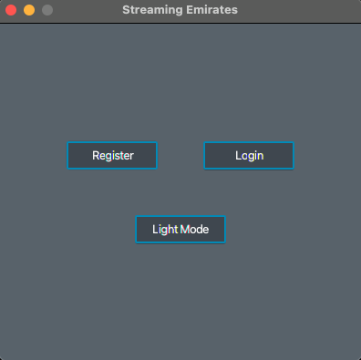
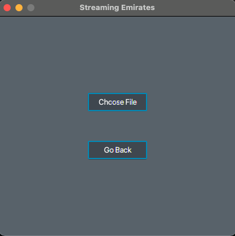
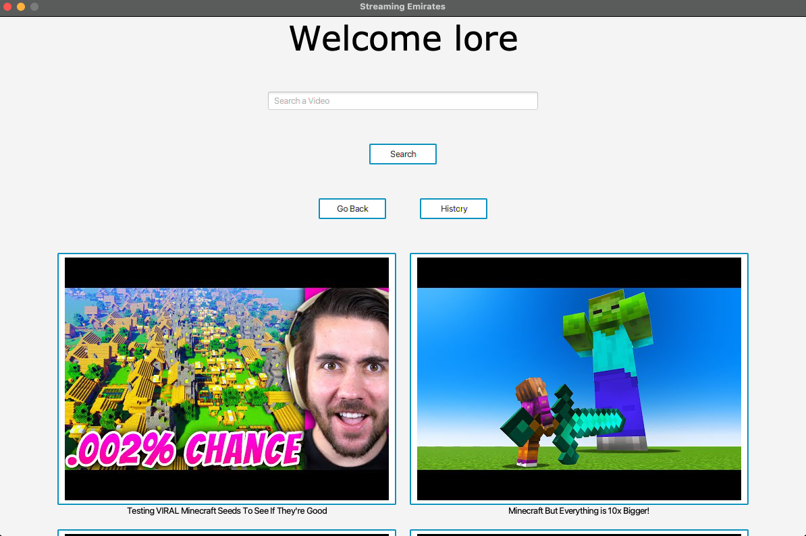
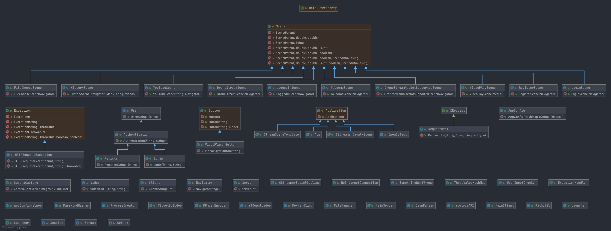

# Streaming-Emirates

## 1 Abstract

In diesem Projekt geht es um eine Streamingdesktopapp. Dort kann man ein Konto erstellen. Man kann dann nach beliebigen
Videos suchen und diese Videos sich anschauen oder auf Wunsch sogar einen Livestream einer IP-Kamera ansehen oder von
der eigenen Webcam. Die angesehenen Videos werden in einem eigenen Suchverlauf gespeichert, den man sich jederzeit
anschauen kann. Wenn dies einem nicht reicht, kann man auch lokale Videos abspielen. Die Videos kann man vor- und
zurückspulen, verschnellern und verlangsamen.

## 2 GUI

 

Beim Start der Applikation kommt dieser Welcome Screen. Der User kann auswählen, ob er sich registrieren möchte oder
direkt einloggen. Man kann auch auswählen, ob man beim nächsten Start im Lightmode ist oder im Darkmode.

---
 

Beim Register Screen ist es sehr einfach. Der User kann sich registrieren mit einem Username und einem Passwort.

---
 

Beim Login Screen kann sich der User einloggen. Der User kann auch entscheiden, ob er eingeloggt bleibt.

---
 

Der Benutzer kann auswählen, ob er Videos von YouTube downloaded, ein Stream schauen will oder er eine Videodatei
abspielen möchte, die auf dem Pc lokal abgespeichert ist.

---
 
Man kann auf Choose File klicken und danach direkt die Videodatei auswählen. Falls man sich verklickt hat, kann man
mit "Go Back" zurück.

---
 

Als Benutzer kann man Videos suchen und diese danach anklicken. Wenn man den Livestream ansehen möchte, kehrt man mit
dem "Go Back" Button in die Loggedin Szene zurück. Sobald die History geladen ist, kann man sein Video verlauf
anschauen.

---
 

Der Benutzer kann beim Klicken von Start die WebCam starten, falls eine Vorhanden ist. Sollte der Benutzer eine IP
Kamera haben, kann er diese mit einem Port aufrufen.

---
 

Der Benutzer kann das Video mit Play abspielen. Er kann auch das Video schneller, langsamer und dann wieder normal
abspielen lassen. Die Lautstärke lässt sich auch anpassen und man kann auch problemlos das Video vorspulen mit dem
Slider.

## 3 UML
### 3.1 Application

Stand: 04.02.2021

---

Stand: 25.02.2021

### 3.2 Server

## 4 Fazit

Unser Projekt ist grundsätzlich gut gelungen. Wir konnten sehr viel mit verschiedenen Libraries experimentieren,
sowie sie für unsere Zwecke nutzen. Wir hatten nicht sehr oft Zeitdruck, da wir sehr schnell vorankamen.
Die Microservices sind nur ein paar Mal abgestürzt (Memory Leak), somit laufen sie auch für unser Level einwandfrei.

Anfangs waren wir jedoch etwas chaotisch unterwegs. Wir haben nie wirklich miteinander abgesprochen, wer was macht.
So hatten wir etwas Mühe mit dem Projekt, mit der Zeit ging dies schon besser.

Unser Projekt entspricht über unseren Anforderungen, somit sind wir alle zufrieden mit unserer Leistung.

Nicht nur haben wir gelernt, wie man besseren Code schreibt, sondern auch dass wir nie FFMPEG verwenden sollten bei Live-Videos.
Wir haben alle zusammen SCRUM Boarding gelernt, aber nicht nur das.
Denn wir haben auch voneinander gelernt.

Wir konnten gut im Team arbeiten und haben so laufend Fortschritt gemacht.
Jeder hatte sein eigenes Spezialgebiet, so konnten wir uns gegenseitig coachen.
Diesbezüglich konnten wir sehr viel alleine lösen und brauchten nicht allzu viel Hilfe von den Coaches.

Was noch fehlt, wäre die Drohnensteuerung. Da wir genug mit dem Stream und den APIS gekämpft haben, reichte die Zeit leider nicht mehr dafür.
Jedoch konnten wir trotzdem ein stabiles Projekt bilden, auf dass wir alle stolz sind und evt. in der Freizeit weiterentwickeln werden.

Was wir das für das nächste Mal verbessern könnten, wäre die Planung.
Wir haben uns kopflos einfach in die Features hineingestürzt, ohne dabei zu überlegen, ob wir dies überhaupt schaffen.
Laufend aber wurde unsere Planung realistischer und wir hatten ein klares Ziel vor den Augen.
Dies sollte aber allerdings früher geschehen nächstes Mal.